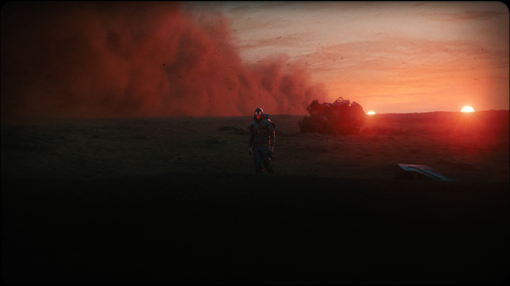
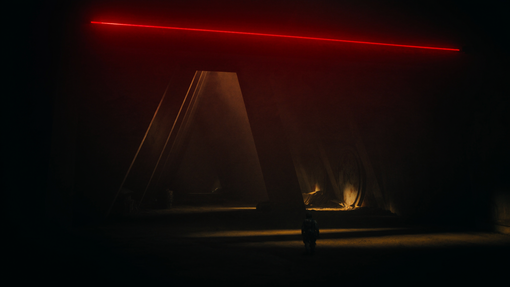
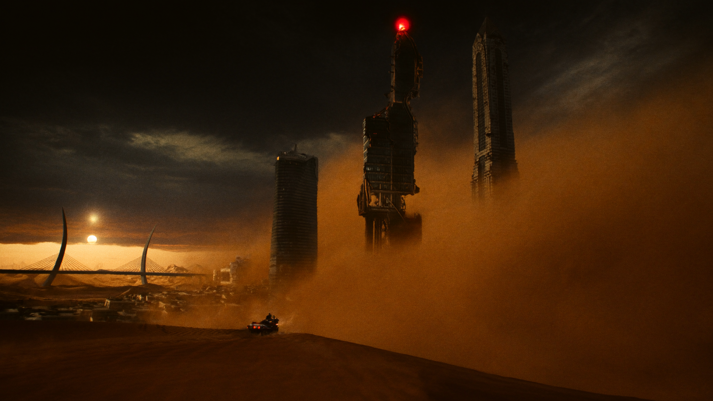

# Direction 01 — Cinematic Apocalypse

## Tagline
**"35 mm at the end of the world."** The site reads like the opening shot of a prestige post-apocalyptic film — RedPad's flagship Dustland is the brand's lens, and every section feels recovered from a survivor's archive.

## Palette
| Token | HEX | Role |
|---|---|---|
| Brand Red — Blood | `#D1141A` | Single saturated accent. Used sparingly: CTAs, beacons, header accent line. **Never on large surfaces.** |
| Coal | `#0A0A0B` | Default page background. Near-black, almost imperceptibly warm. |
| Iron | `#1B1B1D` | Card / panel surfaces, one step up from background. |
| Dust Ochre | `#C9A36A` | Dust storms, atmospheric haze, photo grading on game art. |
| Bone | `#E9E4DA` | Body text on dark surfaces (warmer than pure white, reads cinematic). |

Palette is **80% black-to-iron, 15% dust ochre as atmospheric tint, 5% red.** Red as a precision instrument.

## Typography
- **Display** — `Druk Wide` (Commercial Type) or open alt `Big Shoulders Display` (Google Fonts). Tall, narrow, brutalist. All-caps for hero, mixed case for section heads.
- **Body** — `Söhne` (Klim) or open alt `Inter` 500–700. Neo-grotesk, neutral, lets the photography speak.
- **Mono** — `JetBrains Mono` for credits, dates, system-style overlays.
- **Reasoning**: Druk + Söhne is the editorial pairing of *The New York Times Magazine* covers — gravitas without ornament. Pairs with photoreal Dustland art the way a film poster's title block pairs with its still.

## Motion language
- Easings dominated by `expo.out` and `power3.inOut` — long decays, sense of weight settling.
- Section transitions: **"dust wipe"** — particles rise, briefly obscure, then dissipate to reveal next section. ~900 ms.
- Hero: slow constant **heat-haze warp** on the key art (subtle radial RGB-shift shader, ~0.5 px), plus 5–8 % parallax on three depth layers (foreground figure / mid haze / background ridge).
- Hover micro-interactions: red rangefinder bracket animates to corner of element, ~120 ms.
- Cursor: optional custom cursor that draws a thin red crosshair on hoverable elements. Toggleable.
- Typography: chars enter on a **35 mm "cigarette burn"** flicker — 1–2 frame opacity glitches when section enters viewport.
- Sound design hook: optional ambient wind / distant rumble loop, default OFF, toggleable in footer.

## 3D approach
- **Hero only + section transition particles.** No always-on 3D world.
- Hero scene: a single React Three Fiber scene with the silhouetted figure on a ridge, animated dust planes (instanced), volumetric god-ray cones, a slow camera dolly tied to scroll progress (0–10 % scroll = camera enters dunes).
- Triangle budget: <120 K. All assets glTF + Draco compressed. Target: <2.5 MB initial 3D bundle.
- **Mobile**: 3D replaced with a 6-second seamless Seedance-generated MP4 loop poster on the hero; particle dust wipes become opacity fades.
- `prefers-reduced-motion`: hero becomes a still frame; all dust wipes become 200 ms cross-fades.

## Scroll storytelling pattern
1. **0–10 %** — Hero opens on the ridge silhouette, two-sun rim, dust storm rolling. Tagline fades in. Camera dollies forward 4 m.
2. **10–20 %** — Dust storm wipe reveals the **Tencent Cloud partnership module**. Single horizontal red beacon line draws on. Press release excerpt + logo lockup.
3. **20–45 %** — **Dustland section.** Camera tilts down into desert, wide game-screen embed, faction crests on parallax dust planes, Steam CTA appears with a red rangefinder bracket animation.
4. **45–60 %** — **Wartide Worlds roadmap teaser** as a single warm-dust-tinted panel beneath the Dustland deep-dive.
5. **60–75 %** — **Studio / About** — corporate-structure map, cities (Almaty, Zurich, Delaware, Cayman) revealed by red arc-draws on the map. Pedigree logo wall (EVE / WoW / CoD / etc).
6. **75–90 %** — **Press wall** — quotes, beta KPIs (13.6 K / 65 % D1 / 34 % D3) as large numerals, Steam-status counter.
7. **90–100 %** — **Contact / Careers / Footer** — back to a still ridge silhouette frame with the Vildan portrait edge-cropped, contact CTA.

Signature transition between sections: **dust rises, frame holds 200 ms in near-black, dust falls into next scene**. Feels like film cuts.

## Hero samples (Higgsfield-generated)
- 
- 
- 

## Reference snapshots
- **Larian** — single dominant warm-accent palette, awards mosaic discipline → maps directly to our blood-red accent + Dustland review wall.
- **Kojima Productions** — restraint, single great image > flashy motion, auteur framing → confirms it's OK for the entire site to lean on three or four masterpiece stills instead of motion-everywhere.
- **Awwwards 3D — Where Worlds Take Shape (paodao.fr)** — proves that scroll-driven 3D world entry beats free-roam for editorial sites; we'll borrow the camera-tied-to-scroll pattern.

## Risks / trade-offs
- Red must stay **scarce** — flooding red on this direction would tip from cinematic to garish.
- Dustland-forward framing means Wartide Worlds (the announced second project) needs its own warm-dust tint within the Coal/Iron envelope so it doesn't read as a re-skinned Dustland.
- Mood is heavy. The Tencent Cloud module needs a brief "lift" beat (lighter haze) to avoid press-release feeling buried in apocalypse.
