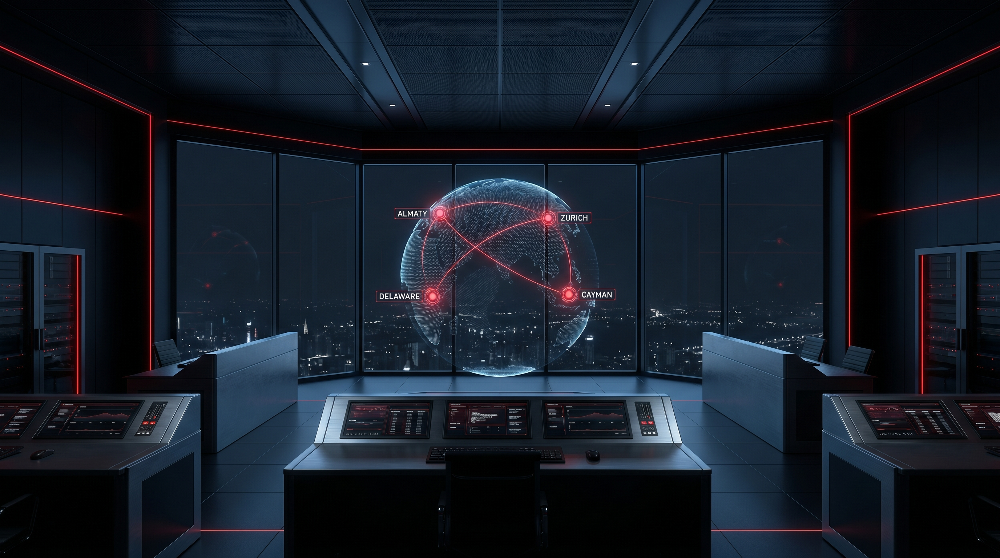
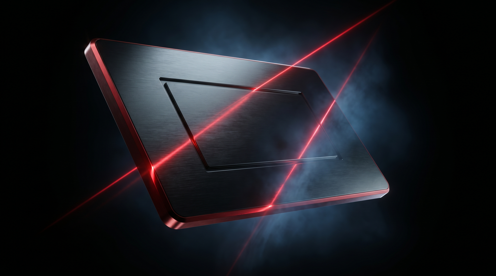
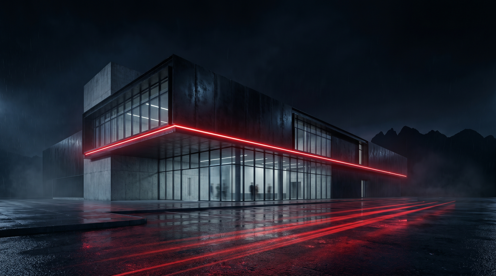

# Direction 02 — Sovereign Studio

## Tagline
**"Mission control for a four-flag studio."** The site reads like the dashboard of a serious operating company — clean, sovereign, partner-ready. A Tencent Cloud infra contact walks in and feels at home.

## Palette
| Token | HEX | Role |
|---|---|---|
| Brand Red — Signal | `#E1141C` | Precision accent. Lasers, status indicators, key CTAs. |
| Obsidian | `#08090C` | Background base, very deep blue-black. |
| Steel | `#1C1F25` | Panel surfaces. |
| Pearl | `#F4F5F7` | Inverse text on light spots, partner logo wall background. |
| Cool Gray | `#9098A6` | Secondary text, telemetry labels. |
| Cyan Hint | `#3DA9FF` | Tiny supporting accent — used only on data viz / globe arcs to keep them readable next to red. |

Palette is **70 % obsidian/steel, 18 % pearl, 8 % red, 4 % cool gray, <1 % cyan.** Two-accent system gives the partner / investor pages cleaner data viz than a red-only system would.

## Typography
- **Display** — `Söhne Breit` or open alt `Space Grotesk` 600–700. Geometric, slightly architectural, calmer than Druk.
- **Body** — `Inter` 400–500 (or `Söhne`). Neutral, instrument-panel readable at small sizes.
- **Mono** — `Berkeley Mono` (paid) or `JetBrains Mono` for telemetry numerals, KPI counters, tickers.
- **Reasoning**: This direction sells **competence and operational scale**. Geometric display + neutral body + crisp mono is the Stripe / Linear / Vercel vocabulary, transposed to a games studio. It says "we run a business" without saying "we forgot we make games" — the imagery still does the gaming work.

## Motion language
- Easings dominated by `power2.out` short and `power4.inOut` for big moves. Snappy.
- Section transitions: **"sweep wipe"** — a 1 px red laser line travels across the screen, content recomposes behind it. ~600 ms total.
- Numerals roll up like an odometer (CountUp.js style) on KPI counters.
- Globe rotation: the corporate-structure globe rotates ~2°/s passively, snaps to the city under cursor on hover with a 220 ms `power3.out`.
- Buttons: thin red border, hover state fills 100 % from left in 180 ms with a faint chromatic aberration on the press.
- Custom cursor: small dot that snaps onto interactive targets (Awwwards favorite) — disabled on touch.
- Typography: characters slide up 12 px and ease into place when scrolled into view, staggered 18 ms per char.
- No film grain. No haze. Crisp and clinical.

## 3D approach
- **Always-on 3D in two zones**: (a) the **hero globe** — a thin-wire planet showing the four operational nodes (Almaty / Zurich / Delaware / Cayman) connected by red arcs, slowly rotating; (b) the **About page corporate map**, same globe re-instantiated with deeper detail.
- Stylization: thin holographic wireframes + flat-shaded landmasses. **No photoreal 3D** — that's Direction 01's domain.
- Triangle budget: <60 K. Wireframe-heavy is cheap. Loads fast.
- **Mobile**: globe collapses to a 2D SVG world map with the same red arc animation. No WebGL on phones.
- `prefers-reduced-motion`: globe freezes; arcs draw once on load and stop pulsing.

## Scroll storytelling pattern
1. **0–8 %** — Hero. Dark room, globe centered, telemetry labels orbit slowly. **Tencent Cloud partnership banner** is a thin sweep across the top from minute zero — "RedPad Games × Tencent Cloud — strategic cloud partnership, signed May 7, 2026, Dubai. Read more →".
2. **8–18 %** — Hero zooms out 30 %, four city pins flash sequentially (Almaty 1.0 s → Zurich → Delaware → Cayman) — establishes scale.
3. **18–30 %** — **Tencent Cloud press release module** — full press copy (cloud-infra framing, not publishing), neutral two-logo lockup, optional video placeholder.
4. **30–50 %** — **Games — Dustland flagship** as a single deep-dive section with a Wartide Worlds roadmap teaser below. The original Riot equal-tiles pattern was scoped down once the studio's verified lineup turned out to be single-flagship.
5. **50–65 %** — **Studio / About**. The hero globe is rebuilt at this scroll position with full detail — entity names, jurisdictions, headcount per city. Pedigree logo wall scrolls horizontally.
6. **65–80 %** — **Partners** — cloud-infra pillars (AWS + Tencent Cloud) featured as peer infra partners; Binance, Xsolla, NVIDIA, Epic Games, Steam etc. on a pearl-background panel (palette inversion = visual breath).
7. **80–92 %** — **Careers** with location tags + role count per city.
8. **92–100 %** — **Contact / footer** — globe returns to an idle slow rotation as the visual "always on" anchor.

Signature transition between sections: **single red laser line sweep**, then a 1-frame chromatic-aberration jolt as the next section locks in. Feels like a holographic console snapping focus.

## Hero samples (Higgsfield-generated)
- 
- 
- 

## Reference snapshots
- **Riot Games** — equal-weight portfolio cards were originally adopted from this reference but later scoped down to single-flagship + roadmap once the studio's verified lineup turned out to be Dustland + Wartide Worlds only.
- **Linear / Vercel / Stripe** (implicit, not in references.md) — the type+motion vocabulary of "serious operating company sites" — borrowed for partner-tier credibility.
- **Awwwards 3D — ASTRODITHER (astrodither.robertborghesi.is)** — proves a single restrained 3D scene, anchored to scroll, can carry the whole site without WebGL fatigue.

## Risks / trade-offs
- This direction is **least game-like** of the three. Players landing on the homepage from a Dustland Steam click might feel "wrong room" before they see the games portfolio — needs the hero to ship a Dustland flash within the first 6 s.
- Two-accent palette (red + cyan hint) is harder to police than a one-accent system. Needs strict design tokens.
- Globe is a recognizable trope (we've all seen the big-brand globe). Differentiate via the four-flag specificity and the red-arc choreography rather than trying to invent a new metaphor.
