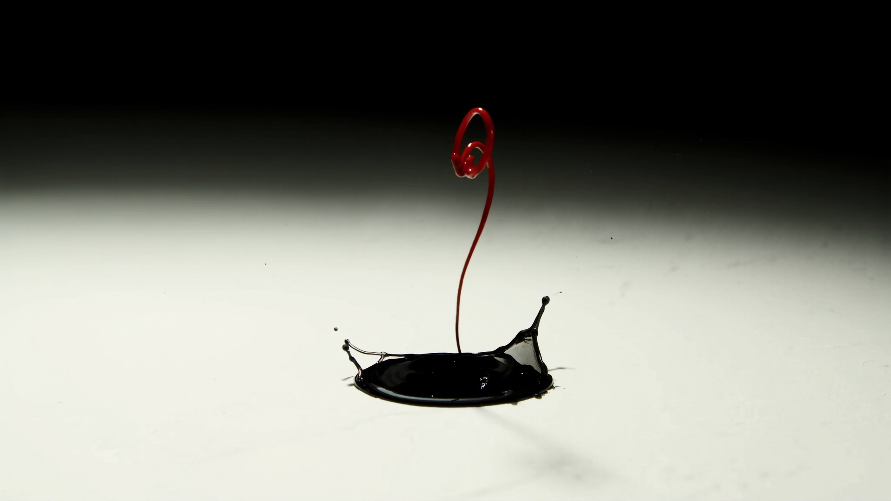
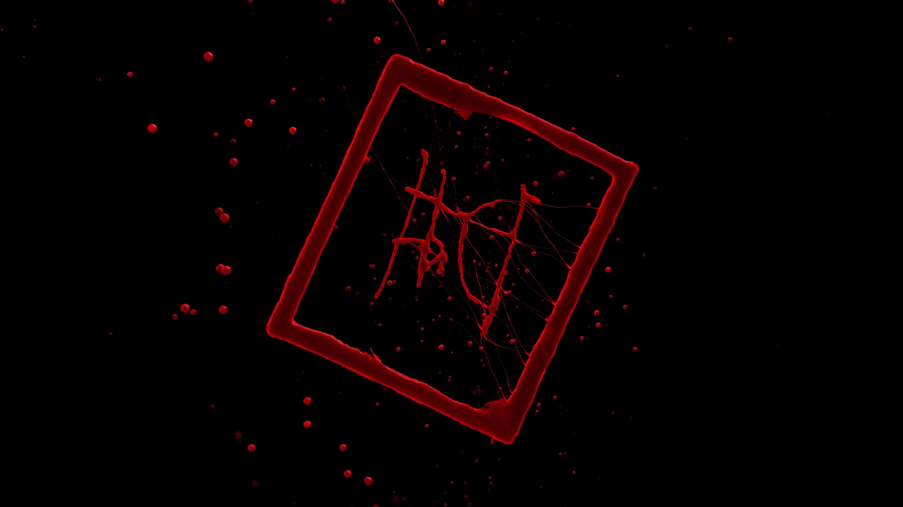
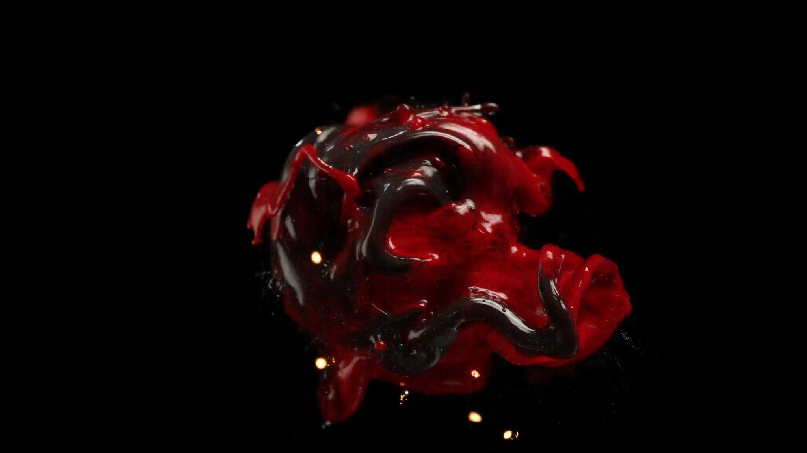

# Direction 03 — Ink & Ember

## Tagline
**"The logo, alive."** The site is the brand mark unfolded — black ink, red pigment, embers. Every section is a frame in a single liquid sequence, and the logo is the sentence the page is writing in real time.

## Palette
| Token | HEX | Role |
|---|---|---|
| Brand Red — Pigment | `#DA1A22` | The "wet ink" hero accent. Generous use allowed in this direction. |
| Pure Black | `#000000` | Ink. Used as full-bleed background for liquid scenes. |
| Paper | `#F8F4EC` | Paper-warm white. Body background for editorial sections. |
| Ember | `#FF6A2C` | Single warm spark accent on transitions; used <1 % of the page. |
| Graphite | `#1F1F22` | Where black-on-black contrast is needed (cards on pure black). |

Palette is **45 % black, 30 % paper, 18 % red, 6 % graphite, 1 % ember.** This is the only direction where red can be a *surface*, not just an *accent*.

## Typography
- **Display** — `PP Editorial New` (Pangram Pangram — paid) or open alt `Cormorant Garamond` for italic display moments. Editorial serif with high contrast.
- **Body** — `Söhne` or open alt `Inter`. Neutral grotesk to anchor the editorial display.
- **Italic display** plays a starring role here (uncommon for game studios) — quotes in big Cormorant italic against ink-black, like a Phaidon art-book spread.
- **Reasoning**: Pairs hot pigment-red with quiet typography intelligence — the type tells you this studio knows craft, not just code. It's the most "Awwwards SOTD" of the three.

## Motion language
- Easings: custom liquid easings — basically `cubic-bezier(0.83, 0, 0.17, 1)` for ink swells, plus `power1.out` for paper-paged sections.
- Section transitions: **"ink page-turn"** — a sheet of paper folds away revealing wet red pigment that floods the next section's bounding box, then the pigment dries into typography. ~1100 ms. Heaviest transition of the three directions, used sparingly (3–4 times across the page).
- Hero: real-time fluid simulation (or pre-baked Seedance loop) of red pigment drops and tendrils — slow, ambient, not jumpy.
- Cursor: leaves a 6 px red ink trail on the paper sections; the trail fades over 800 ms. Disabled on touch.
- Typography: italic display lines have a **slow ink-write reveal** — characters appear as if drawn by a calligraphy nib, ~30 ms per char.
- Hover: text underlines swell into ink ribbons, not flat lines.

## 3D approach
- **Hero only — fluid simulation.** WebGL fragment shader doing a 2.5D fluid sim driven by mouse input + scroll. The simulation makes the red pigment respond to the user's cursor — first interaction is "I drew that".
- Triangle budget: ~0 (it's all shaders / particles, not meshes).
- Performance notes: needs careful FPS budgeting; capped at 30 FPS on lower devices. Pre-bakes a Seedance fallback loop for very low-end.
- Outside the hero: **no 3D**. The page is 2D editorial — printed-magazine cohesion.
- **Mobile**: hero replaced with a Seedance MP4 loop of the same fluid art. No WebGL on phones for this direction.
- `prefers-reduced-motion`: fluid sim becomes a still pigment splash; ink page-turns become 200 ms cross-fades.

## Scroll storytelling pattern
1. **0–8 %** — Hero. Pure black. A single red drop falls, hits, splashes, and the splash's ribbon writes the **studio name + Tencent Cloud announcement headline** in real time. By 6 s of idle the user is reading "RedPad × Tencent Cloud — strategic cloud partnership, signed May 7, 2026, Dubai."
2. **8–18 %** — **Page-turn transition** — paper folds in from the right. Section becomes a paper-warm editorial spread: short studio manifesto in big Cormorant italic, "do what others are afraid of" as a pull quote.
3. **18–35 %** — **Dustland**. Pigment floods the page edge-to-edge. Game art shown as letterboxed stills inside heavy red borders, like a comics spread. Steam CTA is a brushed red ink button.
4. **35–50 %** — **Wartide Worlds roadmap** as a single paper page with a small painted illustration mark in the corner.
5. **50–62 %** — **About** — paper page. Letterhead-like: corporate structure rendered as a typeset table (Cayman / Almaty / Zurich / Delaware), pedigree logos as a strip below.
6. **62–75 %** — **Press** — quotes in giant italic against ink-black, single red bleed mark on each.
7. **75–88 %** — **Careers** — open roles printed as a typeset list, paper texture, room numbers + city tags styled like job postings on a corkboard.
8. **88–100 %** — **Contact / footer** — final ink swell flips the page back to pure black, ember spark crosses the screen, contact details in a calligraphic flourish.

Signature transition between sections: **the literal page-turn**. It's the most theatrical transition of the three directions, so it's used four times only: hero→manifesto, Dustland→About, Press→Careers, Careers→footer.

## Hero samples (Higgsfield-generated)
- 
- 
- 

## Reference snapshots
- **Hoyoverse** (observational) — painted-not-photo hero quality is exactly the spirit of fluid pigment as hero. Hoyoverse uses paint; we use ink.
- **Awwwards Games — Where Worlds Take Shape (paodao.fr)** — proves that art-direction-driven hero (vs game-content-driven hero) wins SOTD when craft is impeccable.
- **Phaidon / Apartamento / Aperture print magazines** — typographic vocabulary of editorial italic display + sparse paper-warm body. Borrowed for tonal contrast against the pigment hero.

## Risks / trade-offs
- **Most polarizing of the three.** Players in a hurry to find the Dustland Steam link may bounce. Mitigation: even within the editorial framing, ship a "Play Dustland" pinned button persistent in the top-right from scroll = 0.
- Italic editorial serif is unusual for game studios — risk of reading "magazine, not games" if the imagery isn't relentlessly high-quality. Demands a strong art-direction pass on every photo + still.
- Page-turn transition is computationally heavier than the other two. Has to be policed with lazy-loading and reduced-motion fallbacks or it tanks Lighthouse on low-end devices.
- Highest chance of winning Awwwards SOTD. Highest chance of dividing internal stakeholders.
